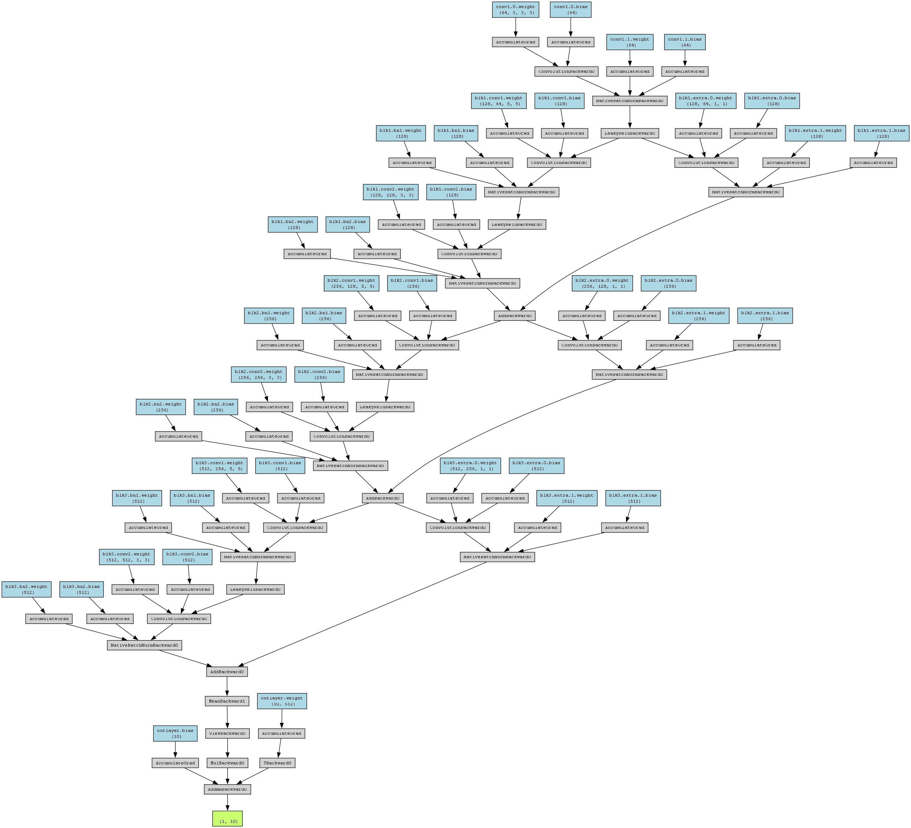

# PyTorch-CIFAR10-ResNet

PyTorch implementation of image classification on CIFAR-10 using custom ResNet architectures with TensorBoard visualization.

---

## 🚀 Project Overview

This project implements image classification on the **CIFAR-10 dataset** using **custom ResNet-based neural networks** built with PyTorch.

It includes:
- Custom ResNet models
- Training / validation pipeline
- Data augmentation
- TensorBoard visualization
- Model evaluation

---

## 📁 Repository Structure
```text id="tree-code"
├── main.py # Training entry point
├── my_model.py # Main ResNet model
├── my_othermodel.py # Additional model variants
├── show_image.py # Visualization utilities
├── resnet_custom_structure.png # Model architecture diagram
├── data/ # CIFAR-10 dataset (auto-downloaded)
├── logs/ # TensorBoard logs
├── README.md
├── LICENSE
└── .gitignore
```

---

## 📊 Dataset

We use the **CIFAR-10 dataset**, which contains:

- 60,000 color images (32×32)
- 10 classes:
  - airplane ✈️
  - automobile 🚗
  - bird 🐦
  - cat 🐱
  - deer 🦌
  - dog 🐶
  - frog 🐸
  - horse 🐴
  - ship 🚢
  - truck 🚚

📦 The dataset will be automatically downloaded via `torchvision`.

---

## ⚙️ Requirements

Install dependencies:

```bash
pip install torch torchvision tensorboard
```

---

## 🧠 Model

This project implements custom ResNet variants, including:

ResNetCustom
Other experimental architectures in my_model.py
Alternative models in my_othermodel.py

The architecture diagram:


---

## 🏋️ Training

Run training with:

```bash
python main.py
```

---

## 📈 TensorBoard Visualization

Start TensorBoard:
```bash
tensorboard --logdir logs
```
Then open in browser:
http://localhost:6006

You can monitor:
- Training loss
- Validation loss
- Validation accuracy

---

## 📌 Training Pipeline
- Load CIFAR-10 dataset
- Apply normalization + augmentation
- Forward pass through ResNet model
- Compute CrossEntropy loss
- Backpropagation (SGD optimizer)
- Evaluate on test set
- Save model

---

## 💾 Model Saving

Model is saved as:
```
cifar-10-1.pth
```

---

## 📌 Notes
- Do NOT upload large dataset files (data/)
- Logs and checkpoints are ignored via .gitignore
- Model can be reloaded using state_dict()
